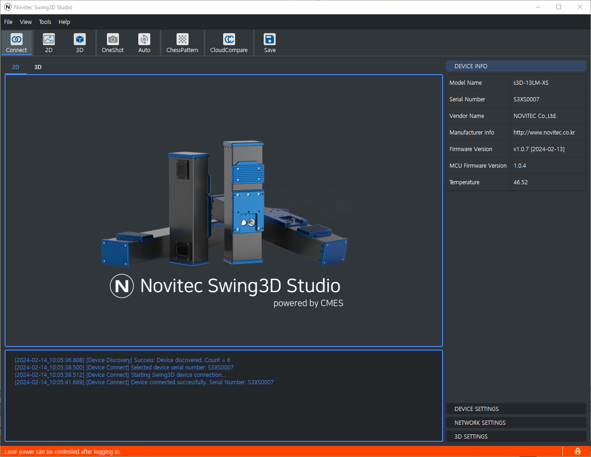

Using Swing3D Studio
---------------------
When you connect to Swing3D from Swing3D Studio,
the status bar turns red, indicating that you need to log in to control the laser power.

To control the laser power, follow the steps below:

1. Click the padlock icon on the right side of the status bar to sign in.

    .. image:: images/swing3d_studio_control_laser_power2.png

2. If the login is successful, a confirmation message will appear, and the status bar will no longer display any warning messages.

    .. image:: images/swing3d_studio_control_laser_power3.png

    .. image:: images/swing3d_studio_control_laser_power4.png

Using API
---------------------
The code to control the laser power using the API is shown below.

.. code-block:: cpp

    unsigned int numOfDevices;
    swing3d::Discover(&numOfDevices);
    if (numOfDevices == 0)
    {
        std::cout << "No devices were found." << std::endl;
        return 0;
    }

    swing3d::Device device;
    swing3d::RET_BOOL ret = device.ConnectBySerialNumber("S3XS0007");
    if (ret.errCode != swing3d::ErrCode::SWING3D_OK)
    {
        std::cout << ret.errorMessage << std::endl;
        return 0;
    }

    // The commands below are ignored because you are not logged in.
    device.SetDeviceSetting(swing3d::DeviceSettings::LaserPower(3000));

    ret = device.Login("user", "1234");
    if (ret.errCode != swing3d::ErrCode::SWING3D_OK)
    {
        std::cout << ret.errorMessage << std::endl;
        return 0;
    }

    // The commands below are not ignored because you are logged in.
    device.SetDeviceSetting(swing3d::DeviceSettings::LaserPower(3000));

