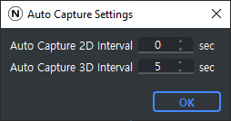

|

Auto Capture Settings Dialog
----------------------------------

The Auto Capture Settings dialog allows users to set the interval for Auto Capture, in seconds.

Update Firmware Dialog
----------------------------------

The Update Firmware dialog allows users to update Swing3D's firmware. Firmware files have the extension .nfw.

Chess Pattern Settings Dialog
----------------------------------
The Chess Pattern Settings dialog allows users to configure the chess pattern to be detected
by the ``CalculateTransformMatrixFromChessPattern()`` API function.

The settings in the figure above are example settings for a chess pattern like the one shown below.

.. image:: chess_pattern.png

