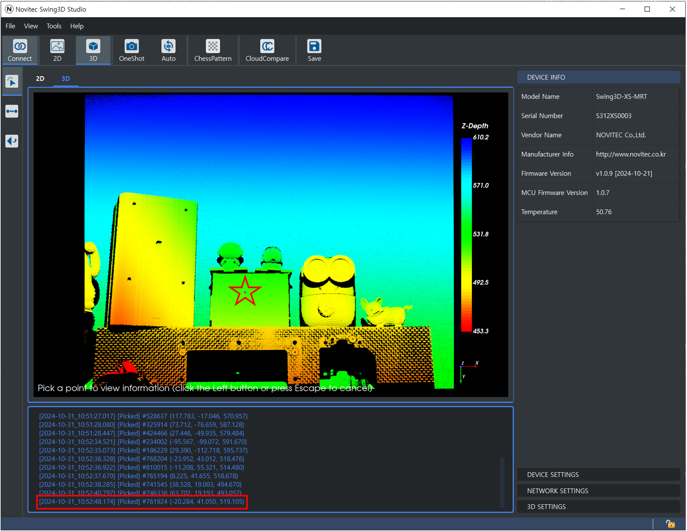
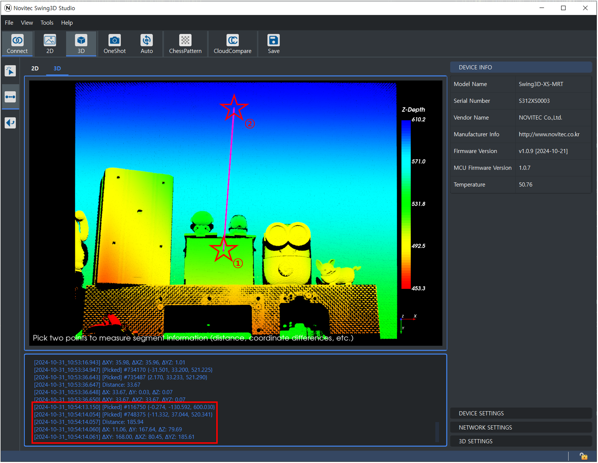
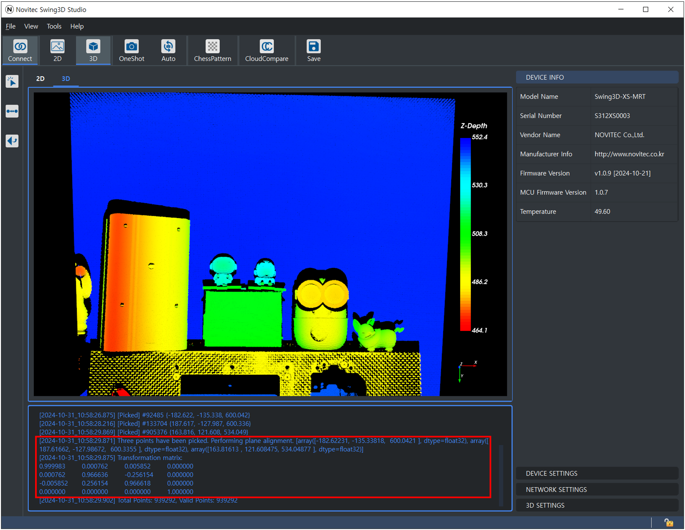

Point Picking
---------------------
Selecting **Point Picking** allows you to click on a point with the left mouse button to view the coordinates (x, y, z) of that point.

Measure Distance
---------------------
Selecting **Measure Distance** enables you to choose two points and check the distance between them.

Once two points are selected, the following information will be displayed in the console:

- **Distance**: The straight-line distance between the two selected points.
- **∆X**: The difference in the X-coordinates of the two points.
- **∆Y**: The difference in the Y-coordinates of the two points.
- **∆Z**: The difference in the Z-coordinates of the two points.
- **∆XY**: The distance difference in the XY plane.
- **∆XZ**: The distance difference in the XZ plane.
- **∆YZ**: The distance difference in the YZ plane.

Pick Three Points
---------------------
Selecting **Pick Three Points** allows you to select three points to perform plane correction.

Select three points as shown in the image above.

Once three points are selected, the point cloud is calibrated to the plane, and the transformation matrix used during the calibration is output to the console.

